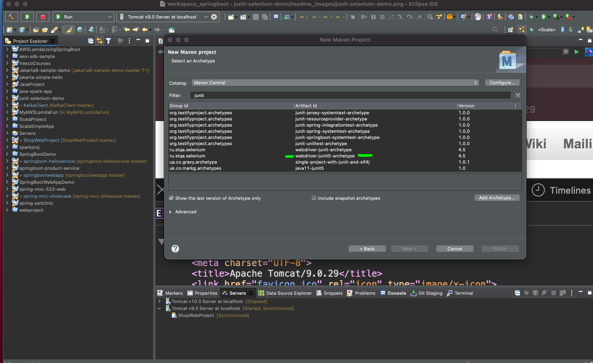

# junit-selenium-demo


## Steps followed for this demo




```

Vinods-MacBook-Pro-2:junit-selenium-demo vinodkumar$ git branch <br>
  list                                                          <br>  
* master                                                        <br>
Vinods-MacBook-Pro-2:junit-selenium-demo vinodkumar$ git branch -m master main  <br>
Vinods-MacBook-Pro-2:junit-selenium-demo vinodkumar$ git branch                 <br>
  list                                                                           <br>   
* main
Vinods-MacBook-Pro-2:junit-selenium-demo vinodkumar$ git push origin main       <br>
To https://github.com/vinodrkumars/junit-selenium-demo.git                      <br>
 ! [rejected]        main -> main (fetch first)                                  <br>   
error: failed to push some refs to 'https://github.com/vinodrkumars/junit-selenium-demo.git'    <br> 
hint: Updates were rejected because the remote contains work that you do                        <br> 
hint: not have locally. This is usually caused by another repository pushing                    <br> 
hint: to the same ref. You may want to first integrate the remote changes                       <br> 
hint: (e.g., 'git pull ...') before pushing again.                                              <br>   
hint: See the 'Note about fast-forwards' in 'git push --help' for details.                      <br> 
Vinods-MacBook-Pro-2:junit-selenium-demo vinodkumar$ git fetch main                             <br> 

<br> 
<br> 

Enumerating objects: 58, done.                                                                  <br> 
Counting objects: 100% (58/58), done.                                                           <br> 
Delta compression using up to 8 threads                                                         <br> 
Compressing objects: 100% (42/42), done.                                                        <br> 
Writing objects: 100% (58/58), 980.11 KiB | 22.27 MiB/s, done.                                  <br> 
Total 58 (delta 1), reused 0 (delta 0)                                                          <br> 
remote: Resolving deltas: 100% (1/1), done.                                                     <br> 
To https://github.com/vinodrkumars/junit-selenium-demo.git                                      <br>   
 + 2271129...aa24794 main -> main (forced update)                                               <br> 
Vinods-MacBook-Pro-2:junit-selenium-demo vinodkumar$ git delete branch list                     <br> 
git: 'delete' is not a git command. See 'git --help'.                                           <br> 
Vinods-MacBook-Pro-2:junit-selenium-demo vinodkumar$                                            <br> 
```
6
<BR>
<BR>

  
  
  mvn clean <br>
  mvn install <br>
  
  
  

  References - <br>
  
  https://www.lambdatest.com/blog/run-junit-from-command-line/
  <br>
  https://www.lambdatest.com/blog/how-to-get-text-of-an-element-in-selenium/
  <br>
  
  
  
  
