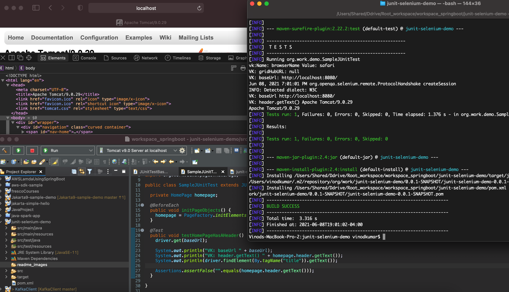

# junit-selenium-demo

Vinods-MacBook-Pro-2:junit-selenium-demo vinodkumar$ git branch 
  list
* master
Vinods-MacBook-Pro-2:junit-selenium-demo vinodkumar$ git branch -m master main
Vinods-MacBook-Pro-2:junit-selenium-demo vinodkumar$ git branch
  list
* main
Vinods-MacBook-Pro-2:junit-selenium-demo vinodkumar$ git push origin main
To https://github.com/vinodrkumars/junit-selenium-demo.git
 ! [rejected]        main -> main (fetch first)
error: failed to push some refs to 'https://github.com/vinodrkumars/junit-selenium-demo.git'
hint: Updates were rejected because the remote contains work that you do
hint: not have locally. This is usually caused by another repository pushing
hint: to the same ref. You may want to first integrate the remote changes
hint: (e.g., 'git pull ...') before pushing again.
hint: See the 'Note about fast-forwards' in 'git push --help' for details.
Vinods-MacBook-Pro-2:junit-selenium-demo vinodkumar$ git fetch main

Vinods-MacBook-Pro-2:junit-selenium-demo vinodkumar$ git push -f origin main
Enumerating objects: 58, done.
Counting objects: 100% (58/58), done.
Delta compression using up to 8 threads
Compressing objects: 100% (42/42), done.
Writing objects: 100% (58/58), 980.11 KiB | 22.27 MiB/s, done.
Total 58 (delta 1), reused 0 (delta 0)
remote: Resolving deltas: 100% (1/1), done.
To https://github.com/vinodrkumars/junit-selenium-demo.git
 + 2271129...aa24794 main -> main (forced update)
Vinods-MacBook-Pro-2:junit-selenium-demo vinodkumar$ git delete branch list
git: 'delete' is not a git command. See 'git --help'.
Vinods-MacBook-Pro-2:junit-selenium-demo vinodkumar$ 

 
 

  
  

